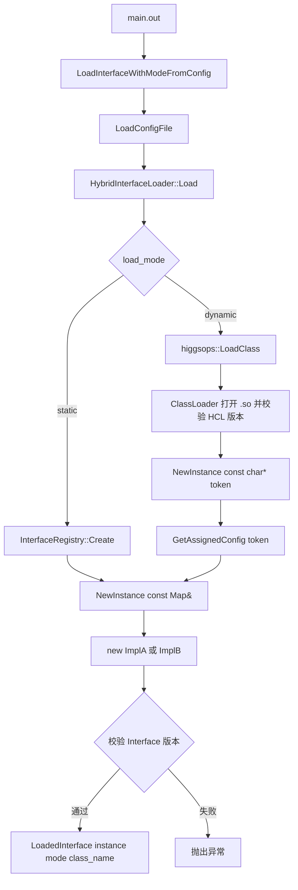
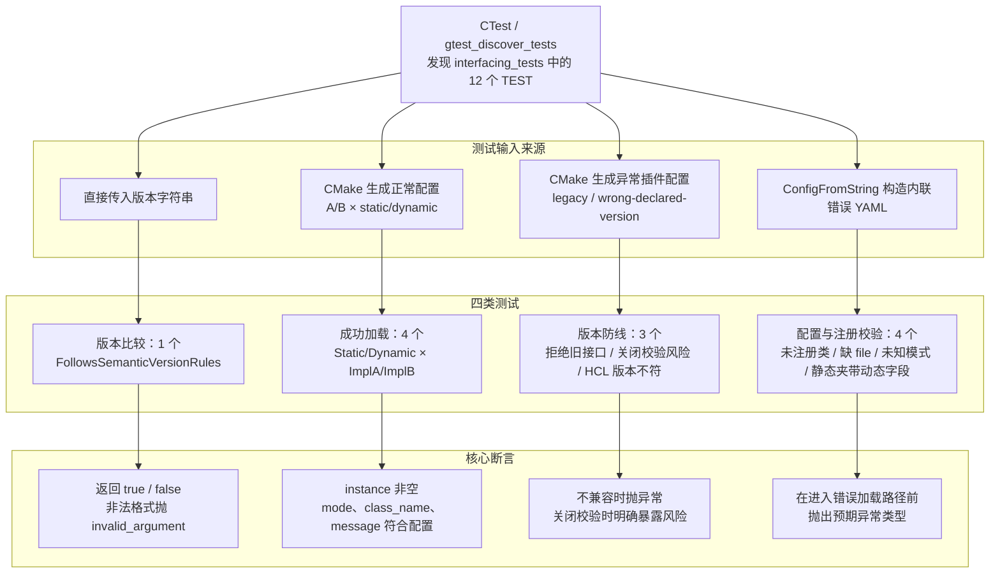

# Interfacing：同时支持静态/动态加载的 C++ 接口作业汇报

> 姓名：金凯胜
> 项目仓库：<https://github.com/JinKaisheng/Interfacing.git>
> 权威工作目录：`/home/jinkaisheng/InterfacingJin/Interfacing`
> 完成情况：基础接口、多实现、静态注册、动态加载、版本校验与自动测试均已完成

## 一、作业目标与最终成果

本项目从 C++ 抽象接口和多态出发，最终实现一个由 YAML 配置驱动、同时支持
静态创建与动态插件加载的统一框架。

当前实现具备以下能力：

- `ImplA`、`ImplB` 共同实现抽象接口 `Interface`；
- 同一份实现源码分别生成静态库和动态库；
- 业务主程序只调用 `LoadInterfaceWithModeFromConfig()` 和 `Interface`；
- `load_mode: static` 通过进程内注册表创建对象；
- `load_mode: dynamic` 通过 Higgs ClassLoader 在运行时加载 `.so`；
- 同一个 `main.out` 可以只切换 YAML，选择实现类和加载模式；
- `LoadedInterface.mode` 明确记录实际走过的静态或动态路径；
- 动态路径校验插件文件版本，静态和动态路径都校验 Interface 契约版本；
- Debug 与 Release 构建均由自动测试覆盖。

需要准确理解“主程序不依赖具体实现”的边界：`autotest/main.cpp` 和通用加载分派
不包含 `ImplA`、`ImplB` 的分支；但是，为了支持内置静态实现，组合根
`builtin_interfaces.cpp` 必须知道并注册具体类型，而且最终可执行文件会链接它们的
静态库。新增动态插件可以不修改业务主程序；新增静态内置实现则需要增加注册并重新
链接程序。

## 二、开发与运行环境

| 项目 | 当前环境 |
|---|---|
| 服务器 | `jinkaisheng@10.214.2.51` |
| 工作目录 | `/home/jinkaisheng/InterfacingJin/Interfacing` |
| 操作系统 | CentOS 7 |
| 编译器 | GCC/G++ 9.3.1，C++17 |
| CMake | 3.22 |
| 构建工具 | Ninja |
| Python | 3.10 |
| ClassLoader 依赖 | HiggsOps.Interface 2.36.0 |
| 测试框架 | gtest 1.12.1 |
| 远程开发 | VS Code 1.98.2 + Remote SSH |

项目通过 `py` 子模块中的 Shannon 公共脚本恢复 CMake/NuGet 依赖。Windows
`C:\LocalCode\Interfacing` 已停用，不是代码或文档的同步来源。

## 三、总体架构



两条路径最终复用 `NewInstance(const Map&)` 和实现构造函数，但进入该公共路径的
方式不同：

```text
静态：Map -> InterfaceRegistry -> NewInstance(Map) -> new Impl(config)

动态：Map -> Higgs ClassLoader -> token -> NewInstance(const char*)
           -> GetAssignedConfig(token) -> NewInstance(Map) -> new Impl(config)
```

## 四、核心类型及职责

| 类型/文件 | 职责 |
|---|---|
| `Interface` | 公共纯虚接口，定义业务操作和 `GetVersion()` |
| `ImplA`、`ImplB` | 具体实现；同时提供 token 工厂和 Map 工厂 |
| `InterfaceRegistry` | 保存“类名 → `NewInstance(Map)`”静态工厂映射 |
| `RegisterBuiltInInterfaces()` | 组合根，集中注册 ImplA、ImplB 静态实现 |
| `HybridInterfaceLoader` | 校验配置、决定加载模式、创建对象并校验接口版本 |
| `LoadedInterface` | 同时返回对象、实际 `LoadMode` 和类名 |
| `main.out` | 读取配置路径，调用统一入口，再通过 `Interface` 使用对象 |

`LoadedInterface.mode` 是判断实际加载模式的权威依据。不能根据 `print()` 输出或
实现类名猜测模式，因为同一个 `ImplA` 可以由两条路径创建。

## 五、配置协议与模式选择

### 5.1 静态配置

```yaml
load_mode: static
class:
  class: ImplA
message: configured-static-A
```

静态模式要求：

- `class.class` 是已注册类名；
- 不得出现 `class.file` 或 `class.ver`；
- 完整根配置 `Map` 直接传给静态工厂。

### 5.2 动态配置

```yaml
load_mode: dynamic
class:
  file: /absolute/path/to/libimpl_a.so
  ver: 1.0.0
  class: ImplA
message: configured-dynamic-A
```

| 字段 | 作用 |
|---|---|
| `load_mode` | 显式选择 `static` 或 `dynamic` |
| `class.class` | 实现类名 |
| `class.file` | 动态插件绝对路径，仅动态模式需要 |
| `class.ver` | 期望的 HCL 插件文件版本，仅动态模式需要 |
| `message` | 传给实现构造过程的业务字段 |

当前项目以显式 `load_mode` 为推荐格式。加载器仍兼容参考项目的推断格式：没有
`load_mode` 时，`class` 中同时存在 `file` 和 `ver` 判定为动态，否则判定为静态；
只出现其中一个字段会被拒绝，避免把残缺的动态配置静默当成静态配置。

HiggsOps.Interface 2.36.0 的动态加载实现读取 `classInfo["class"]`，所以这里使用的
键是 `class`，不是旧注释中可能出现的 `name`。

## 六、静态加载机制

`InterfaceRegistry` 保存的工厂类型是：

```cpp
using StaticInterfaceFactory =
    HiggsIS::Loadable* (*)(const higgsops::config::Map&);
```

注册时，`ImplA` 同时存在两个同名重载，因此通过显式函数指针类型选择 Map 版本：

```cpp
const StaticInterfaceFactory factory =
    static_cast<StaticInterfaceFactory>(&ImplA::NewInstance);
```

加载时执行：

```text
HybridInterfaceLoader
  -> registry_.Create("ImplA", config)
  -> ImplA::NewInstance(const Map&)
  -> new ImplA(message)
```

静态加载的含义是：实现代码已经编译进静态库，并在链接阶段进入 `main.out`；
“加载”发生在程序逻辑层，由注册表选择工厂，不是在运行时打开 `.so`。

## 七、动态加载与 token 机制

动态工厂入口遵守 Higgs ClassLoader 约定：

```cpp
static HiggsIS::Loadable* NewInstance(const char* config_token);
```

实现代码为：

```cpp
HiggsIS::Loadable* ImplA::NewInstance(const char* config_token) {
    return NewInstance(higgsops::GetAssignedConfig(config_token));
}
```

主程序已经解析出完整 `Map`，但 ClassLoader 的工厂调用协议固定使用
`const char*`。LoaderHelper 在同一进程的 HiggsOps 配置注册表中暂存 `Map`，生成
token；插件通过 `GetAssignedConfig(token)` 取回同一份逻辑配置，再委托给 Map 工厂。

token 不是配置正文，也不是为了解决所有 C++ ABI 兼容问题。它只是一个短期查表键，
让固定的工厂函数签名能够传递任意业务配置。主程序、插件及 HiggsOps 仍必须使用兼容
的编译器、标准库 ABI 和 `config::Map` 实现。token 应在 `NewInstance` 调用期间立即
使用，不能作为长期业务状态保存。

动态工厂必须在 `.cpp` 中提供类体外定义。否则未被普通 C++ 调用的 inline 函数可能
不产生可供 ClassLoader 查找的动态符号。

## 八、两层版本校验

### 8.1 HCL 插件文件版本

动态库中的 `plugin_version.cpp` 调用：

```cpp
HCL_SO_VERSION(INTERFACE_VERSION)
```

该宏导出 `HCL_DynamicLibVersion`。动态路径在创建对象前检查：

```text
YAML class.ver == 插件 HCL_DynamicLibVersion
```

这个检查只发生在动态路径，用于发现 YAML 指向了错误版本的插件文件。

### 8.2 Interface 契约版本

`Interface::GetVersion()` 返回实现所支持的接口契约版本。项目规则为：

```text
实现 major == 主程序要求 major
并且
实现版本 >= 主程序要求的最低版本
```

例如主程序要求 `1.2.3`：

| 实现版本 | 结果 | 原因 |
|---|---|---|
| `1.2.3` | 接受 | 完全一致 |
| `1.2.4` | 接受 | 同 major 的 patch 更新 |
| `1.3.0` | 接受 | 同 major 的 minor 更新 |
| `1.2.2` | 拒绝 | 低于最低要求 |
| `2.0.0` | 拒绝 | major 不同 |

代码使用 `std::from_chars` 把 `MAJOR.MINOR.PATCH` 解析成三个整数，避免
字符串比较把 `1.10.0` 错判为小于 `1.2.0`。当前实现只支持三段数字，不是完整的
SemVer 2.0.0 解析器。

接口契约校验在静态和动态两条路径创建对象后都会执行。当前
`GetVersion()`、`HCL_SO_VERSION` 与 CMake `PROJECT_VERSION` 都是 `1.0.0`，
但它们表达的概念不同，后续应分开管理。

## 九、依赖管理

`dependency.nuspec.in` 声明直接依赖：

```xml
<dependency id="HiggsOps.Interface" version="[2.36.0]" />
<dependency id="gtest" version="[1.12.1, 2.0.0)" />
```

恢复命令是：

```bash
bash compile.sh deps
```

它内部执行：

```bash
python py/configuration.py dependency.nuspec.in install/
```

恢复结果位于 `install/include` 和 `install/lib`。HiggsOps 还依赖 HiggsIS、
spdlog、ZeroMQ、libdeflate 等组件，因此不能只复制一个 `libHiggsOps.so`。普通构建
不会自动访问 NuGet；首次克隆、依赖声明变化或 `install/` 缺失时才执行恢复。

## 十、CMake、构建产物与运行

### 10.1 同一实现生成两个库

ImplA 的核心规则是：

```cmake
add_library(impl_a_static STATIC impl_a.cpp)
add_library(impl_a SHARED impl_a.cpp plugin_version.cpp)
```

- `impl_a_static` 编入进程，供 `InterfaceRegistry` 使用；
- `impl_a` 是运行时插件；
- `plugin_version.cpp` 只进入动态库，避免多个静态实现把重复的
  `HCL_DynamicLibVersion` 带入 `main.out`；
- ImplB 使用相同结构；
- `interfacing_loader` 链接两个静态实现库，并集中提供统一入口。

### 10.2 正式构建入口

Debug 构建：

```bash
bash compile.sh debug
```

Release 构建：

```bash
bash compile.sh advanced
```

`compile.sh` 会先执行 CMake 配置，再调用 Ninja 构建，所以目标目录不存在时也能创建。
`advanced` 是项目的 Release 构建目录名，不代表 Debug 缺少高级功能；两者编译的是
同一套静态/动态加载代码。

主要产物：

```text
build/debug/bin/main.out
build/debug/bin/interfacing_tests
build/debug/lib/libimpl_ad.so
build/debug/lib/libimpl_bd.so
build/debug/config/impl_a_static.yaml
build/debug/config/impl_a_dynamic.yaml

build/advanced/bin/main.out
build/advanced/bin/interfacing_tests
build/advanced/lib/libimpl_a.so
build/advanced/lib/libimpl_b.so
build/advanced/config/impl_a_static.yaml
build/advanced/config/impl_a_dynamic.yaml
```

Debug 动态库带 `d` 后缀；Release 动态库不带。YAML 由 `file(GENERATE)` 根据真实
target 路径生成，不应手工改动态库文件名。

### 10.3 运行四种组合

```bash
build/advanced/bin/main.out build/advanced/config/impl_a_static.yaml
build/advanced/bin/main.out build/advanced/config/impl_a_dynamic.yaml
build/advanced/bin/main.out build/advanced/config/impl_b_static.yaml
build/advanced/bin/main.out build/advanced/config/impl_b_dynamic.yaml
```

四次运行使用同一个 `main.out`。首次构建后，只切换 YAML，不需要重新编译。这里的
“不需要重新编译”只适用于已编入程序并已生成插件的 ImplA、ImplB；新增静态类型仍
需要重新构建。

### 10.4 Build 与 Install

`cmake --build build/advanced` 在构建树中生成程序、静态库、动态库和 YAML。
`cmake --install build/advanced` 按 `install(...)` 规则把程序、库和公共头文件整理到
`build/install`。当前安装规则不会安装生成的 YAML，因此安装目录尚不能脱离构建树
直接使用动态配置。

## 十一、自动测试

运行 Debug 测试：

```bash
bash compile.sh debug-test
```

运行 Release 测试：

```bash
bash compile.sh advanced-test
```

`ctest --test-dir ... --output-on-failure` 由 `gtest_discover_tests` 自动发现用例。
当前共有 12 个测试，每个用例的说明如下。

### 测试结构总览



这张图按“测试入口 → 输入来源 → 测试类别 → 核心断言”阅读：

- 版本比较测试不需要文件，直接调用 `IsInterfaceVersionCompatible()`；
- 四个成功加载测试使用 CMake 生成的真实 YAML、静态库和动态插件，直接断言
  `LoadedInterface.mode`，证明实际走过的加载路径；
- 三个版本测试分别覆盖 Interface 契约版本、关闭校验的风险和 HCL 插件文件版本；
- 四个配置与注册测试使用内联错误配置，验证错误在正确的边界被拒绝。

### 11.1 `VersionCompatibility.FollowsSemanticVersionRules`

- **测试名：** `VersionCompatibility.FollowsSemanticVersionRules`
- **场景：** 比较相同版本、同 major 的更高 minor、较低版本、不同 major，并传入
  缺少 PATCH 的非法版本。
- **预期：** 前两种返回 `true`；较低版本和不同 major 返回 `false`；非法格式抛出
  `std::invalid_argument`。

### 11.2 `StaticLoading.LoadsImplementationAAndReportsStaticMode`

- **测试名：** `StaticLoading.LoadsImplementationAAndReportsStaticMode`
- **场景：** 使用 `impl_a_static.yaml` 通过注册表创建 ImplA。
- **预期：** 对象非空，模式为 `LoadMode::Static`，类名为 ImplA，接口版本匹配，
  `print()` 包含 `configured-static-A`。

### 11.3 `DynamicLoading.LoadsImplementationAAndReportsDynamicMode`

- **测试名：** `DynamicLoading.LoadsImplementationAAndReportsDynamicMode`
- **场景：** 使用 `impl_a_dynamic.yaml` 通过 Higgs ClassLoader 加载 ImplA 插件。
- **预期：** 对象非空，模式为 `LoadMode::Dynamic`，类名为 ImplA，`print()` 包含
  `configured-dynamic-A`。

### 11.4 `StaticLoading.LoadsImplementationBAndReportsStaticMode`

- **测试名：** `StaticLoading.LoadsImplementationBAndReportsStaticMode`
- **场景：** 使用 `impl_b_static.yaml` 通过注册表创建 ImplB。
- **预期：** 对象非空，模式为 `LoadMode::Static`，类名为 ImplB，`print()` 包含
  `configured-static-B`。

### 11.5 `DynamicLoading.LoadsImplementationBAndReportsDynamicMode`

- **测试名：** `DynamicLoading.LoadsImplementationBAndReportsDynamicMode`
- **场景：** 使用 `impl_b_dynamic.yaml` 通过 Higgs ClassLoader 加载 ImplB 插件。
- **预期：** 对象非空，模式为 `LoadMode::Dynamic`，类名为 ImplB，`print()` 包含
  `configured-dynamic-B`。

### 11.6 `VersionValidation.RejectsIncompatibleImplementation`

- **测试名：** `VersionValidation.RejectsIncompatibleImplementation`
- **场景：** 在开启接口版本校验时加载 `0.9.0` 的 LegacyImpl。
- **预期：** 统一入口抛出 `std::runtime_error`，旧接口对象不能返回给调用者。

### 11.7 `VersionValidation.DisabledValidationLetsMismatchEscape`

- **测试名：** `VersionValidation.DisabledValidationLetsMismatchEscape`
- **场景：** 显式关闭接口版本校验，再加载 `0.9.0` 的 LegacyImpl。
- **预期：** 对象会以动态模式创建，但 `GetVersion()` 为 `0.9.0`，兼容性判断为
  `false`，证明关闭校验会让不兼容实现逃逸。

### 11.8 `ClassLoaderValidation.RejectsWrongDeclaredLibraryVersion`

- **测试名：** `ClassLoaderValidation.RejectsWrongDeclaredLibraryVersion`
- **场景：** YAML 声明 `class.ver: 9.9.9`，实际 ImplA 插件导出 `1.0.0`，并关闭
  项目层 Interface 校验以隔离 HCL 文件版本检查。
- **预期：** Higgs ClassLoader 在创建对象前抛出异常。

### 11.9 `StaticLoadingValidation.RejectsUnregisteredClass`

- **测试名：** `StaticLoadingValidation.RejectsUnregisteredClass`
- **场景：** 静态配置请求未注册的 `MissingImpl`。
- **预期：** 注册表创建失败并抛出 `std::runtime_error`。

### 11.10 `ConfigurationValidation.RejectsDynamicConfigWithoutFile`

- **测试名：** `ConfigurationValidation.RejectsDynamicConfigWithoutFile`
- **场景：** `load_mode` 为 dynamic，但 `class` 只有 `ver` 和类名，没有 `file`。
- **预期：** 配置校验抛出 `std::invalid_argument`，不会进入 ClassLoader。

### 11.11 `ConfigurationValidation.RejectsUnknownLoadMode`

- **测试名：** `ConfigurationValidation.RejectsUnknownLoadMode`
- **场景：** 配置使用未知模式 `load_mode: surprise`。
- **预期：** 配置校验抛出 `std::invalid_argument`。

### 11.12 `ConfigurationValidation.StaticModeRejectsDynamicFields`

- **测试名：** `ConfigurationValidation.StaticModeRejectsDynamicFields`
- **场景：** `load_mode` 为 static，却同时携带 `class.file` 和 `class.ver`。
- **预期：** 配置校验抛出 `std::invalid_argument`，防止含糊配置被静态路径接受。

这组测试不仅证明对象能创建，还直接断言 `LoadedInterface.mode`、类名、业务配置和
两层版本保护，从而明确区分静态与动态加载。

## 十二、开发过程中解决的问题

### 12.1 依赖闭包缺失

只复制 HiggsOps.Interface 包中的单个库会缺少 HiggsIS、spdlog、ZeroMQ 等传递依赖。
解决方法是用 `dependency.nuspec.in` 和 Shannon 脚本恢复完整依赖闭包。

### 12.2 公司 GitHub 子模块认证

服务器无法直接使用 Windows 私钥。通过 Windows `ssh-agent` 和 Agent Forwarding
把签名能力转发给服务器，私钥不复制到服务器。

### 12.3 CentOS 7 与 VS Code Server 兼容性

新版 VS Code Server 对 glibc/libstdc++ 的要求超过 CentOS 7 环境，因此使用
VS Code 1.98.2，并关闭自动更新以保持 Remote SSH 可用。

### 12.4 动态工厂符号未生成

类体内 inline 的静态工厂在没有普通调用点时可能不产生动态符号。将声明保留在头文件，
在 `.cpp` 中提供类体外定义，再通过 `nm -D | c++filt` 检查导出。

### 12.5 旧构建目录误导

`cmake --build` 只能构建已经配置过的构建树。旧文档中的 `build/server` 已停用，
当前只使用 `build/debug` 和 `build/advanced`；完整入口是 `bash compile.sh debug`
或 `bash compile.sh advanced`。

## 十三、仍可继续改进的方向

当前功能已满足作业要求，仍可继续完善：

1. **完整版本语法。** 拒绝 `01.2.3` 等前导零，并决定是实现完整 SemVer
   预发布规则，还是明确只支持严格的三段数字子集。
2. **ABI 基线检查。** 在 CI 中使用 libabigail 等工具比较新旧插件可见 ABI，并与
   运行测试结合；`nm` 只能确认符号存在。
3. **可迁移安装配置。** 安装 YAML 模板，并实现安装根目录或相对路径解析。当前程序
   没有环境变量占位符展开功能，不能只写占位符就假定可迁移。
4. **CI。** 在有内部 Git/NuGet 权限的干净 Runner 上恢复依赖、构建 Debug/Release、
   执行 CTest 和静态/动态冒烟测试，凭据只通过 Secret 注入。
5. **更多异常测试。** 补充缺失 `class.ver`、错误动态类名、`.so` 不存在、非法
   动态库、缺少工厂符号和工厂返回空指针。
6. **版本职责分离。** 分别维护 Interface 契约版本、插件产品/HCL 版本和项目发布
   版本，避免它们因为当前都等于 `1.0.0` 而被误认为同一概念。

`LoadClass()` 返回空指针的显式保护、缺失 `class.file` 和未注册静态类等测试已经
实现，不再列为未完成事项。

## 十四、现场演示

所有命令都在服务器执行：

```bash
cd /home/jinkaisheng/InterfacingJin/Interfacing
bash compile.sh advanced

build/advanced/bin/main.out build/advanced/config/impl_a_static.yaml
build/advanced/bin/main.out build/advanced/config/impl_a_dynamic.yaml
build/advanced/bin/main.out build/advanced/config/impl_b_static.yaml
build/advanced/bin/main.out build/advanced/config/impl_b_dynamic.yaml

nm -D --defined-only build/advanced/lib/libimpl_a.so | c++filt | grep -E 'NewInstance|HCL_DynamicLibVersion'

bash compile.sh advanced-test
```

演示时应强调：

1. 四次运行使用同一个 `main.out`；
2. 同一个 ImplA 可以由静态和动态两条路径创建；
3. 配置继续切换到 ImplB 时主程序不变；
4. 输出中的 `via static mode` / `via dynamic mode` 来自
   `LoadedInterface.mode`；
5. 测试覆盖成功路径、配置错误和双层版本错误。

汇报前运行完整验收：

```bash
bash .agents/skills/interfacing-maintenance/scripts/verify.sh
```

## 十五、总结

本项目已经从基础多态示例演进为统一的混合加载框架。静态模式提供构建期确定、
进程内直接调用的实现；动态模式提供运行时选择插件的能力。两条路径复用业务配置和
对象构造逻辑，并通过 `LoadedInterface.mode` 明确暴露实际路径。

最终成果不仅是“加载一个 `.so`”，还包括配置协议、静态注册表、ClassLoader 工厂
协议、token 配置桥接、两层版本校验、RAII 生命周期、CMake 双产物和自动测试，形成
了一套可以继续增加实现与工程化能力的完整示例。
